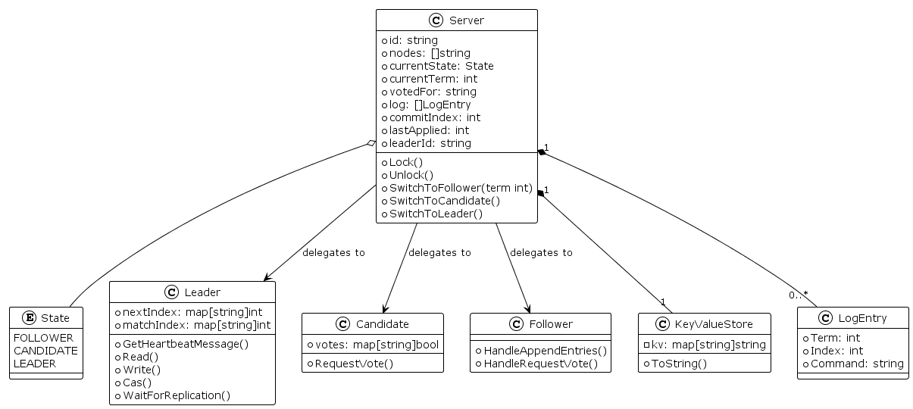

# Raft Consensus Implementation in Go

This project is an implementation of the [Raft Consensus Algorithm](https://raft.github.io/) in Go, designed to pass the Maelstrom (Gossip Glomers) distributed systems challenges. It implements the core features of Raft, including Leader Election, Log Replication, and Safety, along with a generic Key-Value Store state machine.

## Project Structure

The codebase is organized into roles and core components:

*   **`main.go`**: The entry point of the application. It handles the main input loop (reading JSON messages from STDIN), dispatching messages to the appropriate handlers based on the current state of the server, and wiring up the Maelstrom IO.
*   **`node.go`**: Defines the `Server` struct, which is the central context holder. It maintains the persistent state (Current Term, Voted For, Log) and volatile state (Commit Index, Last Applied). It also defines the global types like `LogEntry` and the `KeyValueStore` state machine.
*   **`leader.go`**: Implements the logic specific to the **Leader** state. This includes handling client requests (`read`, `write`, `cas`), managing `nextIndex` and `matchIndex` for followers, and constructing `AppendEntries` RPCs.
*   **`candidate.go`**: Implements the logic for the **Candidate** state, primarily handling `RequestVote` RPCs and election timeouts.
*   **`follower.go`**: Implements the logic for the **Follower** state, including responding to `AppendEntries` (heartbeats and log replication) and `RequestVote`.
*   **`maelstrom.go`**: A helper file for interacting with the Maelstrom test runner. It handles the JSON serialization/deserialization and protocol specifics for the network simulation.
*   **`architecture.puml`**: A PlantUML file describing the class architecture of the system.

## Architecture

The system follows a standard Raft architecture where a `Server` transitions between three states: Follower, Candidate, and Leader.

### Class Diagram

The following UML diagram illustrates the relationship between the main components:



*(Note: To generate this image, compile the `architecture.puml` file using PlantUML.)*

### Key Components

1.  **Server**: The main state vessel. It holds the Log and the State Machine. It delegates behavior to specific role structs (`Leader`, `Candidate`, `Follower`) depending on its `currentState`.
2.  **KeyValueStore**: A simple in-memory map representing the state machine application. It supports `read`, `write`, and `compare-and-swap` (CAS) operations.
3.  **Communication**: The nodes communicate via JSON messages over STDIN/STDOUT, simulating a network as per the Maelstrom protocol.

## Features Implemented

*   **Leader Election**: Randomized election timeouts to prevent split votes.
*   **Log Replication**: Consistent replication of log entries to a quorum of nodes.
*   **Safety**: Only logs committed by a majority are applied to the state machine.
*   **State Machine**: Sequential consistency for key-value operations.
*   **CAS (Compare-and-Swap)**: Atomic operations supported by the log ordering.

## Running the Project

This project is intended to be run with the Maelstrom test runner.

1.  Build the binary:
    ```bash
    go build -o raft
    ```

2.  Run a Maelstrom test (example for Key-Value workload):
    ```bash
    ./maelstrom test -w lin-kv --bin ./raft --node-count 3 --concurrency 2n --rate 10 --time-limit 20s
    ```